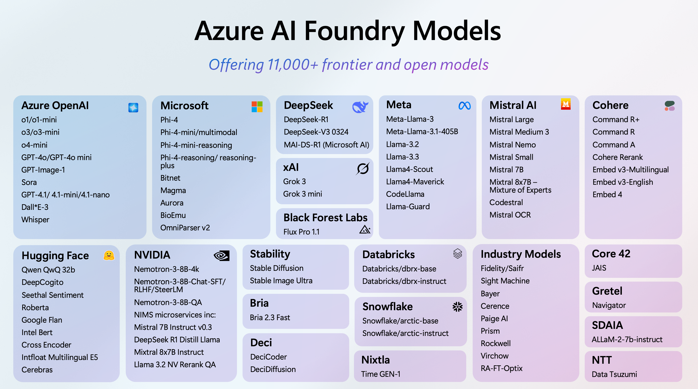
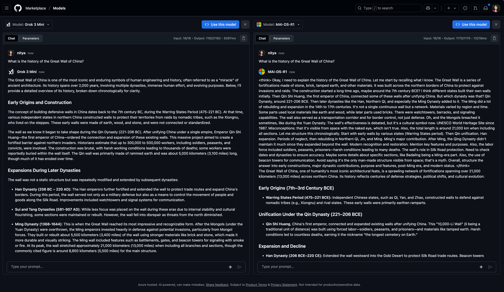

# 1. Foundry Models

!!! info "Azure AI Foundry models offer the best choice for AI developers.   **See: [Model Catalog](https://ai.azure.com/explore/models)**"
    
Every AI developer journey begins with model selection. In this section we focus on the _breadth of new model choices_ available in Azure AI Foundry, and put the spotlight on a few key partners that expand the model catalog in interesting ways.

## 1.1 Grok 3 and Grok 3 Mini

1. Starting today, xAI’s flagship Grok 3 models are available for a **free preview in Azure Foundry for the next 2 weeks**. Grok models are also available to try on GitHub models.
1. According to xAI, Grok 3, the flagship model, **blends unparalleled reasoning with vast pretraining knowledge**, honed on xAI’s Colossus supercluster with 10x the compute power of prior leading models. 
1. **Grok 3 models** excel in reasoning, mathematics, coding, world knowledge, and instruction-following, setting a new standard for enterprise AI. 
1. **Grok 3 Mini**, a lightweight yet powerful thinking model, is optimized for logic-based tasks, delivering efficiency without compromise

!!! info "[Read the blog](https://devblogs.microsoft.com/foundry/announcing-grok-3-and-grok-3-mini-on-azure-ai-foundry/) for more details. Try the [Grok3 Model On Github](https://github.com/marketplace/models/azureml-xai/grok-3-mini/playground?compare_to=MAI-DS-R1)"

---

## 1.2 GPT-Image-1 and SORA

**[GPT-Image-1](https://ai.azure.com/explore/models/gpt-image-1/version/2025-04-15/registry/azure-openai)**: Gpt-image-1 includes significant improvements on image generation: it has generate high-quality images in challenging scenarios and solving challenging prompts. Currently the model has great zero-shot capabilities in image in-painting, photorealistic photos, and wireframe designs.

**[SORA](https://ai.azure.com/explore/models/sora/version/2025-05-02/registry/azure-openai)**: Sora generates videos from text prompts that are provided by the user (with image to video coming soon). It generates videos up to 20s in duration and 1080p resolution. Sora focuses on generating commercially safe content, ideal for customers in advertising, media, and entertainment. It can also be used to create onboarding videos for various enterprises. It is accessible via the Azure OpenAI Service.

---

## 1.3 Hugging Face Expansion

1. 10K+ popular open-source models spanning text, vision, speech, and multimodal models
1. Latest models from top-providers released same-day on Azure AI Foundry and HF Hub
1. Security first - scanning by HF for vulnerabilities, collab with Azure to host secure endpoints
1. Agentic future - bring `smolagents` framework, containerized tools from HF to Azure AI.
1. Azure AI Inference SDK - unified API to frontier and open-source models on Azure AI.

    [**Read the Blog Post**](https://devblogs.microsoft.com/foundry/microsoft-and-hugging-face-expand-partnership-to-accelerate-open-source-ai-innovation-on-azure-ai-foundry/) for more details.

---

## 1.4 Enterprise-Grade Fine Tuning

!!! quote "Reinforcement Fine-Tuning introduces a new level of control for aligning model behavior with complex business logic. By rewarding accurate reasoning and penalizing undesirable outputs, RFT improves model decision-making in dynamic or high-stakes environments."

1. Use Reinforcement Fine-tuning with o4-mini to build reasoning engines that learn from experience and evolve over time. **Use Cases:** Complex decision-making, adaptive workflows, dynamic response generation, and context-sensitive interactions. Available in East US2 and Sweden Central. _Now in public preview_.
1. **Global Training: Expanding Access** - We’re making fine-tuning even more accessible by launching Global Training in public preview. You can now fine-tune Azure OpenAI models from any of the 24 Azure OpenAI regions with reduced per-token training rates, significantly lowering the barrier to entry for model customization.
1. **Developer Tier: Afforable Evaluations** - the most cost-effective way for developers and data scientists to evaluate their fine-tuned OpenAI models. Simultaneously evaluate multiple models to choose the best candidate for production.
1. [**Read the May 19 Blog Post**](https://techcommunity.microsoft.com/blog/aiplatformblog/what%E2%80%99s-new-in-azure-ai-foundry-fine-tuning/44138730)

---

## 1.5 Image Playground

**[Images Playground](https://devblogs.microsoft.com/foundry/images-playground-may-2025/)**: The Images Playground in Azure AI Foundry is a high-fidelity UX sandbox for developers, serving as a reliable testing ground to rapidly prototype with the latest state-of-the-art image generation models – use it to explore GPT-Image-1 (and other visual generative AI models).

<iframe width="800" height="450"  src="https://www.youtube.com/embed/btA8njJjLXY" title="Unveiling GPT-image-1: Rising to new heights with image generation in Azure AI Foundry" allowfullscreen></iframe>

---

## 1.6 Video Playground

**[Video Playground](https://devblogs.microsoft.com/foundry/sora-in-video-playground/)**: The video playground in Azure AI Foundry is your high-fidelity testbed for prototyping with cutting-edge video generation models – like Sora from Azure AI Foundry Models – ready for commercial use.

<iframe width="800" height="450" src="https://www.youtube.com/embed/ewbtbhBJ1UU" title="Unlocking your creativity with Sora in Azure AI Foundry" frameborder="0" allowfullscreen></iframe>
