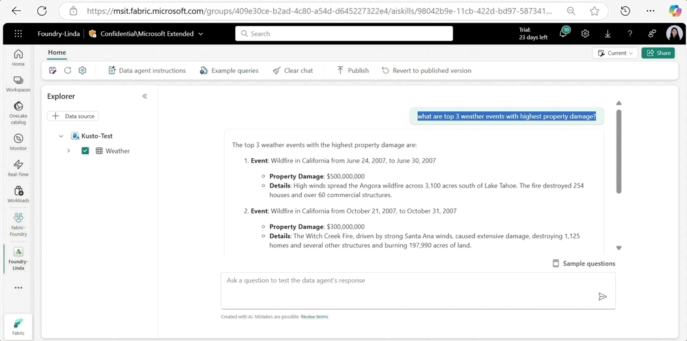

# 3. AI Agent Service

!!! info "[**Read The Blog Post**](https://techcommunity.microsoft.com/blog/azure-ai-services-blog/announcing-general-availability-of-azure-ai-foundry-agent-service/4414352) to see the full list of announcements"

    "Developers must integrate diverse data sources, manage persistent workflows, enforce enterprise-grade security, and ensure smooth interoperability. Meeting these needs requires a flexible, secure platform that abstracts orchestration complexity while maintaining full control."

## 10.1 General 

- First introduced at Microsoft Ignite 2024
- Now used by 10K+ enterprise customers
- Is now generally available with these key features
    - **Multi-Agent** - covered in [multi-agent architecture section](./06.md)
    - **Interoperable Tools** - covered in this section

## 10.2 Interoperable Tools

!!! quote "Agents can't work in isolation. They need knowledge tools (to access enterprise data) and interaction tools (to collaborate with other agents). This requires support for open standards and partner integrations.   [**Read Detailed Blog**](https://techcommunity.microsoft.com/blog/azure-ai-services-blog/expand-azure-ai-foundry-agent-service-with-more-knowledge-and-action-tools/4414404)"

### 10.2.1 Logic Apps As Tools

1. 1400+ Logic Apps connectors
1. Automate complex processes
1. Add actions to trigger agents

### 10.2.2 Expand Knowledge 

1. Built-in knowledge tools for enterprise data
1. SharePoint, Microsoft Fabric, Bing Search
1. Extend agents with context-aware insights

### 10.2.3 Access Partner Tools 

1. Access third-party tools from partners
1. Agent can process domain-specific knowledge
1. Examples: 
    - Workflow automation (Auquan)
    - Process intelligence (Celonis)
    - Insure quotations (InsureMO)
    - Legal insights (LEGALFLY)
    - Legal research (LexisNexis)
    - Investment insights (Morningstar)
    - Trade & Tariffs (Trademo)
    - HR & Automation (MiHCM)

### 10.2.4 Agent Catalog

1. Code samples to jumpstart agent development (reuse)
1. Single-agent & multi-agent code samples (open-source)
1. Developed by Microsoft and partners (enterprise-focused)
1. See: [**Foundry Samples**](https://github.com/azure-ai-foundry/foundry-samples/tree/main/samples/agent-catalog)
1. See: [**Blog Post**](https://techcommunity.microsoft.com/blog/azure-ai-services-blog/building-a-digital-workforce-with-multi-agents-in-azure-ai-foundry-agent-service/4414671)

### 10.2.5 Open Protocols

1. Agent-to-agent (A2A) for interoperable communication
1. Model Context Protocol (MCP) for knowledge sharing
1. Work across Azure, AWS, GCP, and on-prem environments.
1. See: [MCP Server Update: Adding Models, Knowledge & Evaluation](https://devblogs.microsoft.com/foundry/azure-ai-foundry-mcp-server-may-2025/) - May 2025
1. See: [Integrating Semantic Kernel Python with Google’s A2A Protocol](https://devblogs.microsoft.com/foundry/semantic-kernel-a2a-integration/) - Apr 2025
1. See: [Create an MCP Server with Azure AI Agent Service](https://devblogs.microsoft.com/foundry/integrating-azure-ai-agents-mcp-typescript/) - Apr 2025

!!! quote "Start the MCP server"

!!! quote "Explore models using MCP server"

### 10.2.6 Expanded Ecosystem

1. Service is rapidly integrating popular orchestration frameworks
 - CrewAI
 - LangGraph
 - LlamaIndex

## 10.3 AgentOps Tools

1. Building generative AI apps requires a foundation of trust and governance.
1. Built-in AgentOps tools enable end-to-end observability & optimization
1. Two cornerstone features: 
    - **Integrated Tracing**: Step-by-step tracking of agent execution
    - **Advanced Evaluations**: Comprehensive evaluation metrics & insights
1. See: [**AgentOps Blog Post**](https://techcommunity.microsoft.com/blog/azure-ai-services-blog/introducing-built-in-agentops-tools-in-azure-ai-foundry-agent-service/4414389)

!!! quote "Integrated Tracing"

!!! quote "Robust Evaluation & Monitoring"

