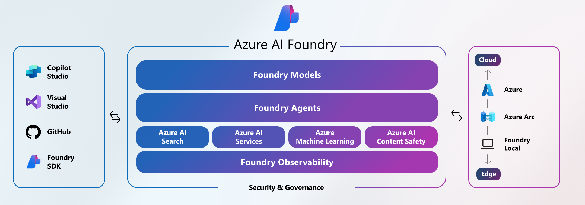
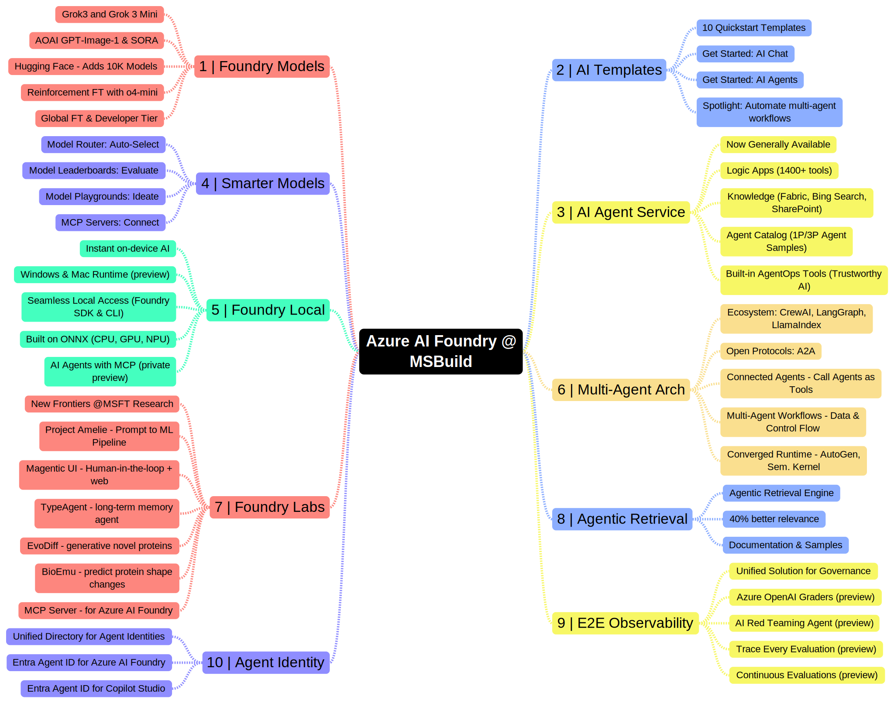

# AI Apps & Agents Factory

!!! info "If I had to summarize the Azure AI Foundry story at Microsoft Build, it would be **unified developer experience for building AI apps and agents anchored by observability and trust**. Let's explore that in this collection."

## 1. The Agent Factory: Stack

The Azure AI Foundry story begins with this refreshed stack that highlights a **unified AI-native development experience** using _Visual Studio Code_, _GitHub_ and _Azure_ to create solutions that effectively span code, collaboration, and cloud.

1. **Foundry Models** - provide the best model choice to jumpstart your dev journey.
1. **Foundry Agents** - enable complex workflows with integrated tools & governance.
1. **Foundry Services** - provide turnkey solutions for search, ML, content safety & more.
1. **Foundry Observability** - provides the end-to-end tools & insights needed for trusted AI.

The _developer tools_ ecosystem (VS Code, GitHub, Copilot Studio and Foundry SDK) focus on streamlining the AI developer experience from idea to production. The _deployment targets_ (Azure, Azure Arc, Foundry Local) provide flexibility in runtime - scaling from the cloud to edge devices.

---

## 2. The Agent Factory: Session

If there is one session to watch from Microsoft Build 2025 that will provide complete coverage of the new items, it is this one! You can watch the video on YouTube - or check out [the session page](https://build.microsoft.com/en-US/sessions/BRK155?source=sessions) for a copy of the slides, transcript and other resources.

<iframe width="800" height="450" src="https://www.youtube.com/embed/DUdRdeUtuZQ" title="Azure AI Foundry: The AI app and Agent Factory | BRK155" frameborder="0" allowfullscreen></iframe>

---

## 3. The Agent Factory: Mindmap
The canonical blog post for Azure AI Foundry at Microsoft Build 2025 [can be found here](https://azure.microsoft.com/en-us/blog/azure-ai-foundry-your-ai-app-and-agent-factory/). As a visual learner, I find it useful to "mind-map" the space to get a better idea of what to explore in a more organized way. **Here is my initial version** highlighting 10 things to explore. I'll dive into each in the next few posts, with relevant links for self-guided exploration.

