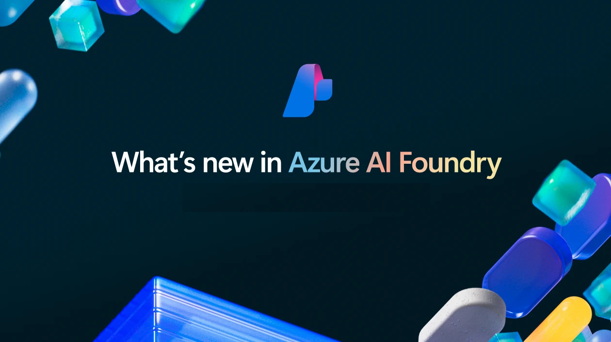

# News & Activity

!!! quote ""
    An _autodidact_ is a person who is self-taught, often by using curated resources to learn independently. Most of us are autodidacts in some context, especially when we have sufficient grounding knowledege in one domain - and can transfer that knowledge to pick up new skills in another domain. This is my self-guided exploration of the Azure AI Foundry platform and ecosystem. I hope you find it useful!

---

## 1. Microsoft Build: May 2025

[Azure AI Foundry](https://learn.microsoft.com/azure/ai-foundry/what-is-azure-ai-foundry) was at the heart of core announcements at Microsoft Build 2025. 

!!! info "I'll explore some of the announcements in more detail in my **MSBuild 2025** collection. In the meantime, bookmark these resources for your learning journey."

1. [**Azure AI Foundry: Your AI App and agent factory**](https://azure.microsoft.com/en-us/blog/azure-ai-foundry-your-ai-app-and-agent-factory/) - canoncial recap from CVP Asha Sharma.
1. [**Microsoft Build 2025: Book of News**](https://news.microsoft.com/build-2025-book-of-news/#a-211-new-models-and-partnerships-added-to-azure-ai-foundry-models) - Official announcements list, with focus on "AI".
1. [**Azure AI Foundry: Documentation**](http://aka.ms/AzureAI) - quickstarts, concepts, tutorials & reference docs.
1. [**Azure AI Foundry: Download SDK**](http://aka.ms/aifoundrysdk) - C#, Java, JavaScript & Python options
1. [**Azure AI Foundry: Discord**](https://aka.ms/ai/discord) - Join the community for AMAs, news, events and more.
1. [**Azure AI Foundry: Discussions Forum**](https://aka.ms/azureaifoundry/forum) - Get help, give product feedback, show-and-tell etc.

---
